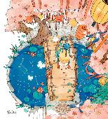

### This an image that is a file in the directory



### This an image that is located on the web .


### This a code block with syntax highlighting for the programming language being used

``` c++
for (int i=0;i<10;i++){cout<<"lucky"<<endl;}
for (int i=0;i<10;i++){cout<<"hello world"<<endl;}
```


# [A link to another page](Beautiful.md)

